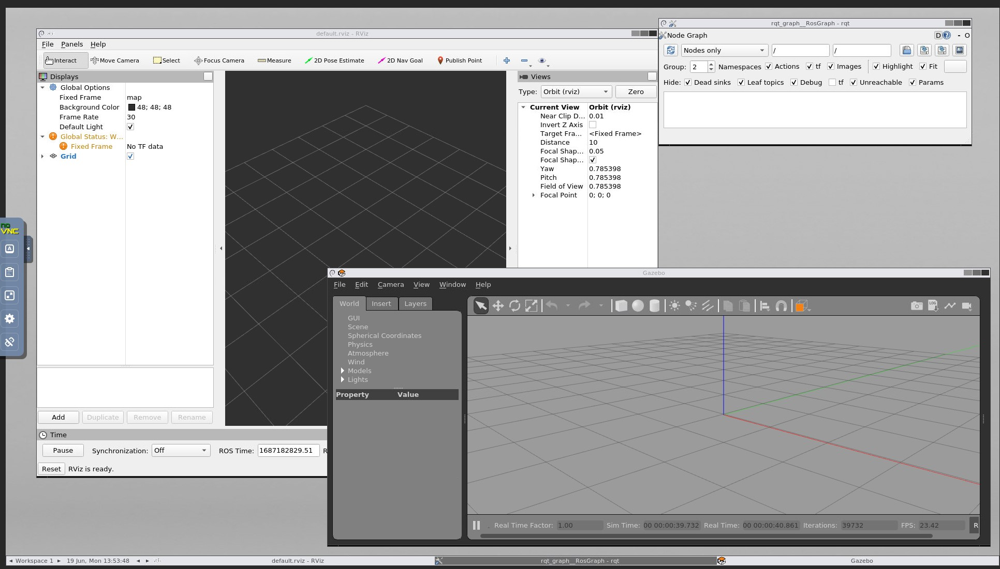
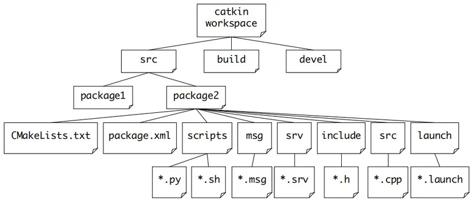

# Dockerized setup for ROS 1 and Gazebo

This dockerized environment provides:
- [ROS 1](https://www.ros.org/) with [Catkin](https://wiki.ros.org/catkin/)-ready workspace
- [Gazebo](https://gazebosim.org/), [RViZ](http://wiki.ros.org/rviz) and rqt_graph GUI available via [noVNC](https://novnc.com/)



---

## Run the docker compose setup

Run setup with:
```
docker compose up
```

The noVNC GUI is available at `http://localhost:8080/vnc.html`.

To wipe the docker environment:
```
docker compose down -v
```

## Use the catkin workspace

The catkin workspace `catkin_ws` is in the `catkin_ws` docker compose container at `/root/catkin_ws/`.

<p align=center>
    <br>
    <em>Catkin workspace file structure (courtesy: <a href="https://developpaper.com/" target="_blank">Develop Paper</a>)</em>
</p>


To work with that:
```sh
# Connect to the container
docker exec -it ros_docker-catkin_ws-1 bash
# Manually source the entrypoint
source /ros_entrypoint.sh
# Build workspace
cd /home/catkin_ws
catkin_make
```

To manage packages in the catkin workspace, check out [catkin/Tutorials/CreatingPackage](http://wiki.ros.org/catkin/Tutorials/CreatingPackage) and [catkin/Tutorials/using_a_workspace](http://wiki.ros.org/catkin/Tutorials/using_a_workspace)
